# Pandas basic plotting examples
First of all, import all these libraries below

[TOC]


```python
import pandas as pd
import numpy as np
import matplotlib.pyplot as plt
```

Now, before plotting lets prepare some data!


```python
# time series
time_series = pd.DataFrame(np.random.randn(1000), index=pd.date_range('1/1/2000', periods=1000))
time_series = time_series.cumsum()

# generic dataset
ds = pd.DataFrame({'A':np.random.randn(10000), 'B':np.random.randn(10000), 'C':np.random.randn(10000), 'D':np.random.randn(10000)*3})

ds_cumsum = ds.cumsum() # cumulative sum of generic dataset
ds_cumsum['index'] = list(range(len(ds_cumsum)))
small_ds = ds.sample(10) # small sample of generic dataset

# ds with only natural numbers
A = np.random.randint(0, 100, 100)
B = np.random.randint(0, 100, 100)
C = np.random.randint(0, 100, 100)
ds_natural = pd.DataFrame({'A':A,'B':B,'C':C})
ds_natural
ds_natural_cumsum = ds_natural.cumsum()
ds_natural_small = ds_natural.sample(10)
```

# Bar plots

#### Vertical Bar blots


```python
ds.iloc[2].plot.bar()
```


    <matplotlib.axes._subplots.AxesSubplot at 0x7fcbffc63d68>


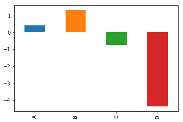


we can adding horizontal lines by using the axhline function in plt:


```python
plt.figure()
ds.iloc[2].plot.bar()
plt.axhline(0, color='k')
```


    <matplotlib.lines.Line2D at 0x7fcbffbe3278>


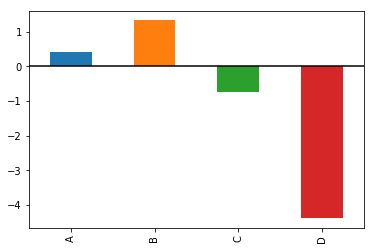


#### Horizontal Bar Plots


```python
plt.figure()
ds.iloc[2].plot.barh()
plt.axvline(0, color='k') # for vertical lines use axvline
```


    <matplotlib.lines.Line2D at 0x7fcbffc44278>


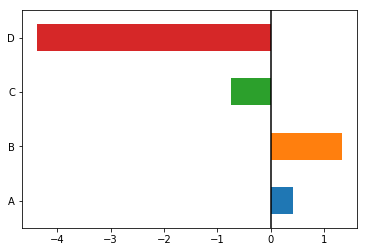


#### Another examples of barplots


```python
ds_natural_small.plot.bar()
```


    <matplotlib.axes._subplots.AxesSubplot at 0x7fcbffc763c8>


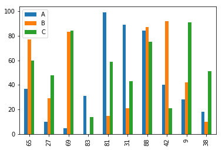


```python
ds_natural_small.plot.barh()
```


    <matplotlib.axes._subplots.AxesSubplot at 0x7fcbffb8b7f0>


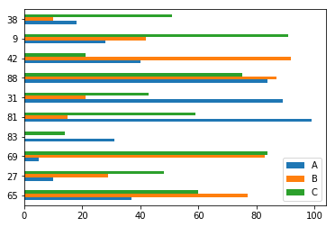


```python
ds_natural_small.plot.bar(stacked=True)
```


    <matplotlib.axes._subplots.AxesSubplot at 0x7fcbffaebd30>


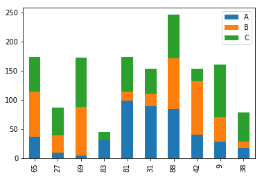


```python
ds_natural_small.plot.barh(stacked=True)
```


    <matplotlib.axes._subplots.AxesSubplot at 0x7fcbffa5bbe0>


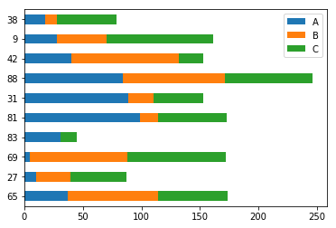


# Line plots

by calling DataFrame.plot(), the line plot is the default plot


```python
ds_cumsum.drop('index', axis=1).plot()
```


    <matplotlib.axes._subplots.AxesSubplot at 0x7fcc1643afd0>


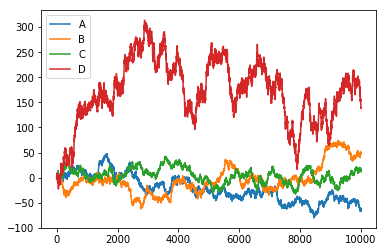


```python
ds_cumsum.plot(x='index',y='B', color='lightgreen')
```


    <matplotlib.axes._subplots.AxesSubplot at 0x7fcbffcaaef0>


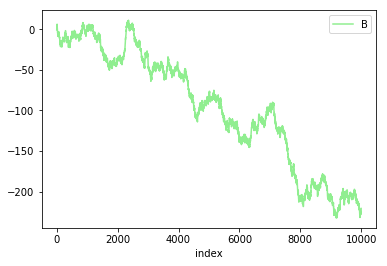


#### Another line plots


```python
ds_cumsum.drop('index', axis=1).plot(subplots=True, figsize=(10,10))
```


    array([<matplotlib.axes._subplots.AxesSubplot object at 0x7fcc14641ac8>,
           <matplotlib.axes._subplots.AxesSubplot object at 0x7fcc1459cf28>,
           <matplotlib.axes._subplots.AxesSubplot object at 0x7fcc145c1e80>,
           <matplotlib.axes._subplots.AxesSubplot object at 0x7fcc145d60f0>], dtype=object)


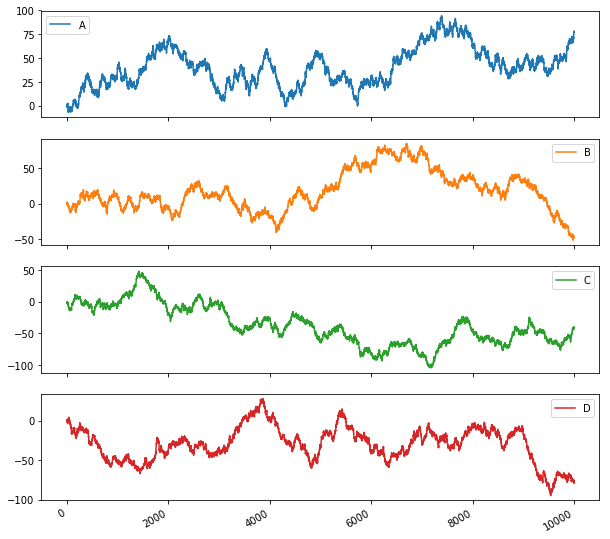


```python
plt.figure()
ds_cumsum.A.plot()
ds_cumsum.B.plot(secondary_y=True)
```


    <matplotlib.axes._subplots.AxesSubplot at 0x7fcc144bed30>


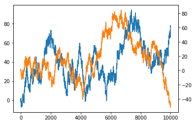


# Histograms
only use DataFrame.plot.hist()


```python
ds.A.plot.hist()
```


    <matplotlib.axes._subplots.AxesSubplot at 0x7fcc0453e9b0>


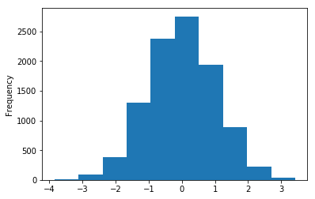


```python
# specific dataset for overlap histogram
ds_hist = pd.DataFrame({'A':np.random.randn(1000)-1,'B':np.random.randn(1000),'C':np.random.randn(1000)+1}) 
```


```python
ds_hist.plot.hist()
```


    <matplotlib.axes._subplots.AxesSubplot at 0x7fcbff4eccc0>


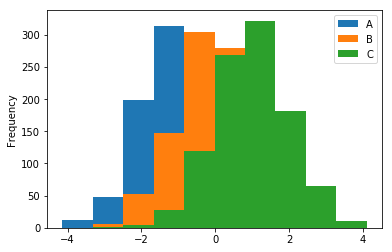


```python
# by using alpha parameter we can set transparency
ds_hist.plot.hist(alpha=.4)
```


    <matplotlib.axes._subplots.AxesSubplot at 0x7fcbff9b9978>


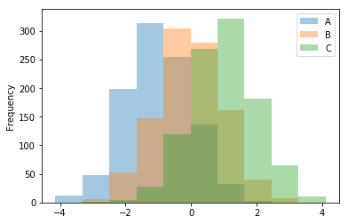


```python
# we can stack the histograms too
ds_hist.plot.hist(stacked=True, colormap='cool')
```


    <matplotlib.axes._subplots.AxesSubplot at 0x7fcbff3add30>


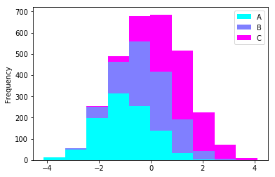


```python
# hist with subplots
ds_hist.plot.hist(subplots=True, layout=(1,3), figsize=(16,5), colormap='cool')
```


    array([[<matplotlib.axes._subplots.AxesSubplot object at 0x7fcbfecbbda0>,
            <matplotlib.axes._subplots.AxesSubplot object at 0x7fcbfec569b0>,
            <matplotlib.axes._subplots.AxesSubplot object at 0x7fcbfebf9828>]], dtype=object)


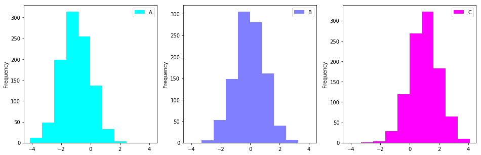


# Boxplots


```python
small_ds.plot.box()
```


    <matplotlib.axes._subplots.AxesSubplot at 0x7fcbfebb2dd8>


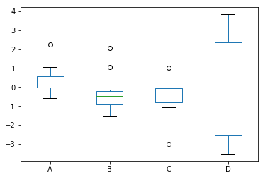


```python
small_ds.plot.box(vert=False)
```


    <matplotlib.axes._subplots.AxesSubplot at 0x7fcbff083048>


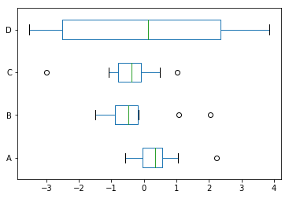


# Area plots


```python
ds_natural.plot.area(figsize=(16,6))
```


    <matplotlib.axes._subplots.AxesSubplot at 0x7fcbfe720518>


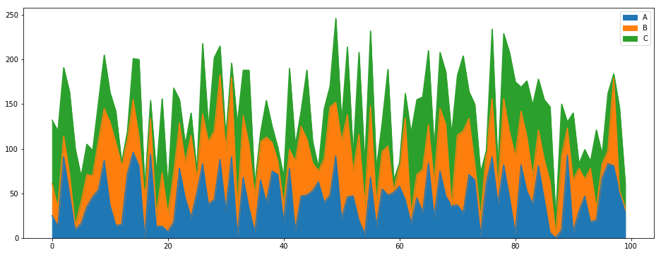


```python
ds_natural.plot.area(stacked=False, figsize=(16,6))
```


    <matplotlib.axes._subplots.AxesSubplot at 0x7fcbfe6c7710>


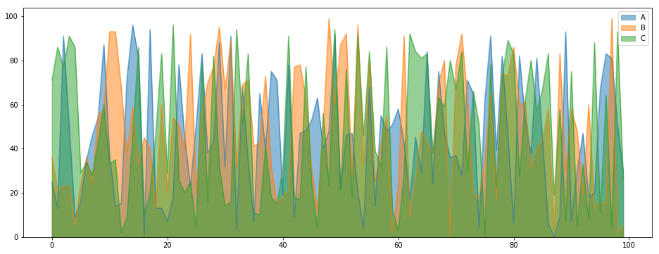


```python
from pandas.plotting import scatter_matrix
```


```python
scatter_matrix(ds, diagonal='kde')
```


    array([[<matplotlib.axes._subplots.AxesSubplot object at 0x7fcbfe576e10>,
            <matplotlib.axes._subplots.AxesSubplot object at 0x7fcbfe368470>,
            <matplotlib.axes._subplots.AxesSubplot object at 0x7fcbfe30b518>,
            <matplotlib.axes._subplots.AxesSubplot object at 0x7fcbfe2ad5f8>],
           [<matplotlib.axes._subplots.AxesSubplot object at 0x7fcbfe2d15f8>,
            <matplotlib.axes._subplots.AxesSubplot object at 0x7fcbfe26af28>,
            <matplotlib.axes._subplots.AxesSubplot object at 0x7fcbfe295198>,
            <matplotlib.axes._subplots.AxesSubplot object at 0x7fcbfe238198>],
           [<matplotlib.axes._subplots.AxesSubplot object at 0x7fcbfe25b208>,
            <matplotlib.axes._subplots.AxesSubplot object at 0x7fcbfe268518>,
            <matplotlib.axes._subplots.AxesSubplot object at 0x7fcbfe218908>,
            <matplotlib.axes._subplots.AxesSubplot object at 0x7fcbfe1ba908>],
           [<matplotlib.axes._subplots.AxesSubplot object at 0x7fcbfe1e0908>,
            <matplotlib.axes._subplots.AxesSubplot object at 0x7fcbfe181828>,
            <matplotlib.axes._subplots.AxesSubplot object at 0x7fcbfe1a42e8>,
            <matplotlib.axes._subplots.AxesSubplot object at 0x7fcbfe1472e8>]], dtype=object)


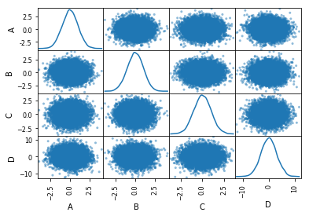

```python
ds.plot.hexbin(x='A',y='B', gridsize=25, colormap='inferno')
```


    <matplotlib.axes._subplots.AxesSubplot at 0x7fcbfdf6f588>


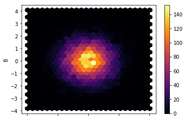

